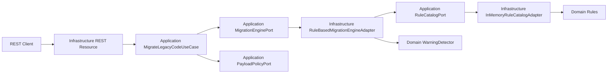

# Legacy2Modern Backend

Quarkus 3.27 backend with Java 21 and strict hexagonal architecture for the `migration` module.

## Structure

```text
src/main/java/art/ourhyt/legacy2modern/
  migration/
    domain/
    application/
    infrastructure/
```

## Hexagonal Diagram



## API

`POST /migrate`

Headers:
- `Content-Type: application/json`
- `X-API-KEY: <key>`

Body:

```json
{
  "sourceLanguage": "COBOL",
  "targetLanguage": "JAVA",
  "targetVersion": "21",
  "code": "IF A = B THEN\nDISPLAY 'OK'\nEND-IF"
}
```

## Local Run

```bash
export MIGRATION_API_KEY=dev-api-key
./mvnw quarkus:dev
```

## Test

```bash
mvn test
```

## AWS Deployment Notes

- Frontend: CloudFront + S3
- Backend: API Gateway + Lambda or container on ECS/Fargate
- Logs: CloudWatch Logs for request metadata and error tracking
- Recommended controls: API Gateway usage plans, WAF rate limiting rules, AWS Secrets Manager for API key

## Security Risks and Mitigations

- Risk: unauthorized access
- Mitigation: required `X-API-KEY` validated against `MIGRATION_API_KEY`

- Risk: oversized payload denial-of-service
- Mitigation: HTTP body limit (`200K`) and application limits (`max bytes`, `max lines`)

- Risk: unsafe code execution
- Mitigation: deterministic string transformation only, no eval/compile/run path

- Risk: sensitive data exposure in logs
- Mitigation: logs include metadata only and never raw input code
